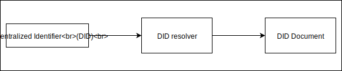

This document is provides a bit more in depth and more technical information about DID and two DID methods: ETHR and IPID.
It also aims at giving a bit more in-depth treatment of the concepts and technologies around IPFS, which may help to
build a better understanding of how IPID DID Method can be applied to Cogito Identity.

> Document was not reviewed, thus it may still contain some inconsistencies here and there.

# Self-describing identifiers

Take a following character string: `zdpuB3Pn7miXhJ7pGM38EcSJ7mugkAMX3kHAPyVggXHJrRERo`. What is this? Well, it looks like an encoded string. But what kind of encoding it is? Maybe an (experienced) human may be able to guess that this is an Base58-Bitcoin encoding, but (even an experienced) a machine would have trouble to guess what is this. Same applies for hash - what hash algorithm has been used to create this hash: `FC29B7C591BA89D05AFF2CE9ED0C249A5947434EFD8BBFC1C5553C4955997FE2` We human will see that is most probably a base-16, with 64 characters, meaning it encodes an array of 32 bytes, giving 256 bits. Is this a `sha-256` hash? Maybe...

In the world of crypto, where algorithms get updated in response to discovered security vulnerabilities, being able to to build systems that are able to respond to that change with predicable effort is important. This is the objective of the [Multiformats](https://multiformats.io) project: a collection of protocols which aim to future-proof systems.

Take the above hash. A future-proof way of encoding this hash would be to use a [multihash](https://multiformats.io/multihash/) - a self describing hash. A multihash has the following format:

```
<hash-func-type><digest-length><digest-value>
```

For the `hash-func-type` we use a [table](https://github.com/multiformats/multihash#table-for-multihash), where we find out that `sha2-256` has encoding `0x12`. The digest length is `32` bytes, which is `0x20`. Our multihash is therefore:

```
1220FC29B7C591BA89D05AFF2CE9ED0C249A5947434EFD8BBFC1C5553C4955997FE2
```

And so we also have `multibase` for self-describing base encodings, `multicodec` for self-describing serialization, and more.

But, what does it all have to do with Cogito Identity?

## Self-describing identity

Here is an example of Cogito Identity: `0x661f410803c9F3dA7592ef699d8590B33Bf59F29`. This is in fact an Ethereum address. A machine processing it, would not know. A human would not know either, unless we told him what it is.

Ideally, when a machine looks at a Cogito identity, it should be able to tell where to find a public key corresponding to that identity, how to authenticate to a service using that identity, where to find claims about that identity, and more.

This is where we can immediately benefit from the concepts introduced by [Credentials Community Group](https://w3c-ccg.github.io/did-spec/) in the [Decentralized Identifiers](https://w3c-ccg.github.io/did-spec/) specification.

Let's take a look at the picture below:



We see here two new concepts: a *DID resolver* and a *DID document*. A DID resolver takes a DID and returns the DID document corresponding to this DID. What is then a DID document?

In simple terms a DID document provides the details about this specific DID. For instance it may list public keys associated with this specific DIDs, provide a list of service endpoints that can be used to prove the control of the public key, to provide access to claims owned by the owner of the given DID, etc.

How do we know which DID resolver to use for the given DID? This is described by the *method*, which defines how a specific DID scheme can be implemented on a specific distributed ledger or network. This will include information on how a DID can be resolved. The DID method is included in the DID itself. A DID is a string starting with `did:`, followed by the *method* string, and the method specific identifier itself. A [DID Method registry](https://w3c-ccg.github.io/did-method-registry/#the-registry) lists all the registered DID methods.

For example, in the [DID method for Ethereum](https://github.com/uport-project/ethr-did-resolver/blob/develop/doc/did-method-spec.md), a method specific identifier is created by prepending `did:ethr:` to a valid Ethereum address. A big advantage of this DID method is that a DID can be created completely off-line. Resolving a DID reduces to basically calling a `resolve` function providing a DID as an argument. The did resolver takes the Ethereum address, checks for the current owner, looks at contract events and builds a simple DID document.

```javascript
import resolve from 'did-resolver'
import registerResolver from 'ethr-did-resolver'

registerResolver()

resolve('did:ethr:0xf3beac30c498d9e26865f34fcaa57dbb935b0d74').then(doc => console.log)

// You can also use ES7 async/await syntax
const doc = await resolve('did:ethr:0xf3beac30c498d9e26865f34fcaa57dbb935b0d74')
```

A disadvantage of a DID based on Ethereum is that it needs...Ethereum.

A promising alternative is a DID method based on [IPLD](https://ipld.io) - the data model of the content-addressable web that brings a interoperability between different content-addressable protocols. IPLD is used in [IPFS](https://ipfs.io) to structure and link all the data chunks/objects. In simple terms, IPFS is a content addressable distributed storage, where the physical location of the stored content depends on the content itself.

Let's use the following simple script to add a text file to IPFS:

```javascript
const ipfs = ipfsClient('/ip4/127.0.0.1/tcp/5001')

const path = process.argv[2] || 'f1.txt'
const content = Buffer.from(process.argv[3] || 'Welcome to IPFS')

const files = [{ path, content }]

ipfs.add(files).then(result => {
  console.log('result=', result)
  process.exit()
}, error => {
  console.log('error:', error)
  process.exit()
})

process.stdin.resume()
```

```bash
$ node writeFile f1.txt "Welcome to IPFS"
result= [ { path: 'f1.txt',
    hash: 'QmPytofvrWjTSmMzZvKMnNaNRAbQykBqCgqgv1Dw52bRpv',
    size: 23 } ]
```

The `QmPytofvrWjTSmMzZvKMnNaNRAbQykBqCgqgv1Dw52bRpv` is a so called content identifier (CID). There are already two versions of CID: `v0` and `v1`. By default version `v0` is used, which means that CID is simply a multihash encoded using `base58btc` encoding. Moreover, the content is serialized using `dag-pb` encoding, and the hash algorithm used in the multihash is `sha2-256`.

Indeed, if we decode the CID, we will get the following (hex) stream:

```
122018661D7E4FF2FC5DC5652F26DC7F9FC59D5A1A5F2B1C7C004037C83672BC209B
```

We see the first two bytes to be `0x12` and `0x20` which indicates the type of the hash function and the length of the digest respectively.

The value of the hash itself is then:

```
18661D7E4FF2FC5DC5652F26DC7F9FC59D5A1A5F2B1C7C004037C83672BC209B
```

The hash is computed over a *dag-pb* (MerkleDAG Node in Protobuf)
serialization. The code below shows how to the hash is computed:

```javascript
const dagPB = require("ipld-dag-pb")
const multihashes = require("multihashes")
const sha256 = require("js-sha256").sha256
const CID = require("cids")
const UnixFS = require("ipfs-unixfs")

const getDagPB = txt => new Promise((resolve, reject) => {
  const fileBuffer = Buffer.from(txt)
  const file = new UnixFS('file', fileBuffer)
  
  dagPB.DAGNode.create(file.marshal(), (err, node) => {
    if (err) {
      reject(err)
    }
      resolve(node)
  })
})

const serialize = node => new Promise((resolve, reject) => {
  dagPB.util.serialize(node, (err, binaryBlob) => {
    if (err) {
      reject(err)
    }
    resolve(binaryBlob)
  })
})

const node = await getDagPB('Welcome to IPFS')
const binaryBlob = await serialize(node)
const hash = Buffer.from(sha256.arrayBuffer(binaryBlob))
const mhash = multihashes.encode(hash, 'sha2-256')
const cid = new CID(0, 'dag-pb', mhash)
const encodedCid = cid2.toBaseEncodedString()
console.log('CID=', encodedCid)
```

CIDs v1 do not use `dag-pb` but `dag-cbor`. CBOR stands for *Concise Binary Object Representation*. Most CBOR objects are valid DagCBOR. The only hard restriction is that any field with the tag 42 must be a valid CID.

Now let's see how a valid v1 CID is created:

```javascript
const dagCBOR = require("ipld-dag-cbor")
const multihashes = require("multihashes")
const sha256 = require("js-sha256").sha256
const CID = require("cids")

const obj = {
  text: "Welcome to IPFS"
}

const getDagCBOR = obj => new Promise((resolve, reject) => {
    dagCBOR.util.serialize(obj, (err, serialized) => {
      if (err) {
        reject(err)
      }
      resolve(serialized)
    })
})

const serialized = await getDagCBOR(obj)
const hash = Buffer.from(sha256.arrayBuffer(serialized))
const mhash = multihashes.encode(hash, 'sha2-256')
const cid = new CID(1, 'dag-cbor', mhash)
const encodedCid = cid.toBaseEncodedString()
console.log('CID=', encodedCid)
```

The resulted CID is: `zdpuAr7p8fC3dtErumUJcH3GfhsK1xR54s4nUhm37hRpPpTGn`.

To verify, lets put actual object in IPFS. For this we use the `ipfs dag put` command:

```bash
$ ipfs dag put --format=dag-cbor --hash=sha2-256 -- ./TestObj.json
zdpuAr7p8fC3dtErumUJcH3GfhsK1xR54s4nUhm37hRpPpTGn
```

Here, `TestObj.json` contains:

```json
{
  "text": "Welcome to IPFS"
}
```

> The input to `ipfs dag put` can also be provided using stdin:
>
> ```bash
> echo "{\"text\": \"Welcome to IPFS\"}" | ipfs dag put --format=dag-cbor --hash=sha2-256
> ```

CID v1 has the following format (see also https://github.com/multiformats/cid):

```
<cidv1> ::= <multibase-prefix><cid-version><multicodec-content-type><multihash-content-address>
```

The `multibase-prefix` is `z`, which indicates `base58btc` encoding (see https://github.com/multiformats/multibase). Indeed if we strip the first `z` from CID and then we decode using `base58btc` decoder we will get:

```
0171122054A225BE1BAB7453661939930DEAD194702F37947ABFF9B0B073372A148EF253
```

We see here the CID version to be version 1 (`0x01`), `multicodec-content-type` to be `dag-cbor` (`0x71`, see https://github.com/multiformats/multicodec), and then we have the multihash:

```
122054A225BE1BAB7453661939930DEAD194702F37947ABFF9B0B073372A148EF253
```

We see then that we can consistently create and encode self-describing data structures and we can conveniently store them on IPFS. How can we use this concept to support DIDs?

## IPID DID Method

[IPID DID Method](https://did-ipid.github.io/ipid-did-method/) describe how to use IPFS/IPLD for DIDs. A DID method specifies how having a DID, get the corresponding DID method. As we saw it above, for the DID method for Ethereum, we get the DID a-priori, and then we use the resolver to get the corresponding DID. Here, the sequence is opposite. We first create a DID document to get its CID. Now, we know that the CID will change every time we the DID gets updated. This means that using CID alone as the DID would not be very pragmatic, because we would never know if it refers to the most recent version of the corresponding DID document. Fortunately, IPFS has a clean and elegant solution for this as well: [IPNS](https://docs.ipfs.io/guides/concepts/ipns/). IPNS allows us to create *mutable addresses* that can be updated to point to the intended CID.

Let's follow the examples provided in the [IPID DID Method](https://did-ipid.github.io/ipid-did-method/) document to get an idea how the whole process works.

Creating a new identity starts with creating an initial DID document, like one presented below:

```json
{
  "@context": {
    "/": "zdpuAmoZixxJjvosviGeYcqduzDhSwGV2bL6ZTTXo1hbEJHfq"
  },
  "created": "2018-12-01T03:00:00Z",
  "publicKey": [
    {
      "curve": "ed25519",
      "expires": "2019-12-01T03:00:00Z",
      "publicKeyBase64": "qmz7tpLNKKKdl7cD7PbejDiBVp7ONpmZbfmc7cEK9mg=",
      "type": "EdDsaPublicKey"
    }
  ],
  "updated": "2018-12-01T03:00:01Z"
}
```

The DID document uses [IPLD](https://ipld.io) (InterPlanetary Linked Data). IPLD have a lot in common with [JSON-LD](https://json-ld.org) format (JavaScript Object Notation for Linked Data) but enables cryptographic guarantees to the authenticity of the JSON-LD schema. The first thing we may notice is the `@context` attribute. Attributes that start with `@` have special, well-defined, meaning in JSON-LD. The two most important are `@context` and `@id`. We describe the `@id` attribute later in the sequel, and now we will shortly look at the `@context` attribute. `@context` provides the meaning to the attributes used in the document. It serves disambiguation and provides the value types that the attributes can keep. In a typical JSON-LD document the `@context` attribute is a link pointing to another (JSON-LD) document, e.g. https://example.org/context.jsonld. In contract to JSON-LD, however, IPLD relies on Content Identifiers (CIDs) for content addressing. A link in IPLD is represented in JSON as a *link object* and uses the path syntax `/` as the key and the CID as the value.

In the DID document above we have thus:

```json
"@context": {
  "/": "zdpuAmoZixxJjvosviGeYcqduzDhSwGV2bL6ZTTXo1hbEJHfq"
}
```

It indicates that the context for this document is described by a CID `zdpuAmoZixxJjvosviGeYcqduzDhSwGV2bL6ZTTXo1hbEJHfq`. We can retrieve the context document using the following command:

```bash
$ ipfs dag get zdpuAmoZixxJjvosviGeYcqduzDhSwGV2bL6ZTTXo1hbEJHfq | jq
```

It returns the following content:

```json
{
  "@context": {
    "@version": 1.1,
    "AuthenticationSuite": "sec:AuthenticationSuite",
    "CryptographicKey": "sec:Key",
    "EquihashProof2017": "sec:EquihashProof2017",
    "GraphSignature2012": "sec:GraphSignature2012",
    "IssueCredential": "didv:IssueCredential",
    "LinkedDataSignature2015": "sec:LinkedDataSignature2015",
    "LinkedDataSignature2016": "sec:LinkedDataSignature2016",
    "RsaCryptographicKey": "sec:RsaCryptographicKey",
    "RsaSignature2015": "sec:RsaSignature2015",
    "RsaSignature2017": "sec:RsaSignature2017",
    "RsaSignatureAuthentication2018": "sec:RsaSignatureAuthentication2018",
    "RsaSigningKey2018": "sec:RsaSigningKey",
    "UpdateDidDescription": "didv:UpdateDidDescription",
    "authentication": "sec:authenticationMethod",
    "authenticationCredential": "sec:authenticationCredential",
    "authorizationCapability": "sec:authorizationCapability",
    "canonicalizationAlgorithm": "sec:canonicalizationAlgorithm",
    "capability": "sec:capability",
    "comment": "rdfs:comment",
    "created": {
      "@id": "dc:created",
      "@type": "xsd:dateTime"
    },
    "creator": {
      "@id": "dc:creator",
      "@type": "@id"
    },
    "dc": "http://purl.org/dc/terms/",
    "description": "schema:description",
    "didv": "https://w3id.org/did#",
    "digestAlgorithm": "sec:digestAlgorithm",
    "digestValue": "sec:digestValue",
    "domain": "sec:domain",
    "entity": "sec:entity",
    "equihashParameterAlgorithm": "sec:equihashParameterAlgorithm",
    "equihashParameterK": {
      "@id": "sec:equihashParameterK",
      "@type": "xsd:integer"
    },
    "equihashParameterN": {
      "@id": "sec:equihashParameterN",
      "@type": "xsd:integer"
    },
    "expires": {
      "@id": "sec:expiration",
      "@type": "xsd:dateTime"
    },
    "field": {
      "@id": "didv:field",
      "@type": "@id"
    },
    "id": "@id",
    "label": "rdfs:label",
    "minimumProofsRequired": "sec:minimumProofsRequired",
    "minimumSignaturesRequired": "sec:minimumSignaturesRequired",
    "name": "schema:name",
    "nonce": "sec:nonce",
    "normalizationAlgorithm": "sec:normalizationAlgorithm",
    "owner": {
      "@id": "sec:owner",
      "@type": "@id"
    },
    "permission": "sec:permission",
    "permittedProofType": "sec:permittedProofType",
    "privateKey": {
      "@id": "sec:privateKey",
      "@type": "@id"
    },
    "privateKeyPem": "sec:privateKeyPem",
    "proof": "sec:proof",
    "proofAlgorithm": "sec:proofAlgorithm",
    "proofType": "sec:proofType",
    "proofValue": "sec:proofValue",
    "publicKey": {
      "@container": "@set",
      "@id": "sec:publicKey",
      "@type": "@id"
    },
    "publicKeyPem": "sec:publicKeyPem",
    "rdfs": "http://www.w3.org/2000/01/rdf-schema#",
    "requiredProof": "sec:requiredProof",
    "revoked": {
      "@id": "sec:revoked",
      "@type": "xsd:dateTime"
    },
    "schema": "http://schema.org/",
    "sec": "https://w3id.org/security#",
    "seeAlso": {
      "@id": "rdfs:seeAlso",
      "@type": "@id"
    },
    "signature": "sec:signature",
    "signatureAlgorithm": "sec:signatureAlgorithm",
    "signatureValue": "sec:signatureValue",
    "type": "@type",
    "xsd": "http://www.w3.org/2001/XMLSchema#"
  }
}
```

We will not go into details of the context document itself, important for now is just how the context can be used to provide the meaning to the document itself.

### Publishing 1st version of the DID document

Having the initial version of our DID document, let's publish it to IPLD. We put the DID document in a file `did-doc-v0.json` and then we execute:

```bash
ipfs dag put --format=dag-cbor --hash=sha2-256 -- ./did-doc-v0.json
zdpuB3Pn7miXhJ7pGM38EcSJ7mugkAMX3kHAPyVggXHJrRERo
```

Our initial CID is thus `zdpuB3Pn7miXhJ7pGM38EcSJ7mugkAMX3kHAPyVggXHJrRERo`. We cannot use CID as a DID because CID is immutable. Every time we change the DID Document, we will get a new CID. For a DID we need something that always resolves to the CID of the most recent version of the DID document. This is where IPNS will help.

Every node on the IPFS network has its own identity. This identity is a cryptographic key-pair. When you installed IPFS on your machine you run `ipfs init` a folder on your machine was created as `~/.ipfs`. You will see something like this in the terminal:

```bash
$ ipfs init
initializing ipfs node at /Users/jbenet/.go-ipfs
generating 2048-bit RSA keypair...done
peer identity: QmQUcC5iRXee1QCgavsT1oWwGRzbSZPm8PhudWmUGWDmp8
```

More specifically, if you do  `cat ~/.ipfs/config` you will find more details. Specifically, you will find the identity attribute containing the `PeerID` and the `PrivKey`:

```json
"Identity": {
  "PeerID": "QmQUcC5iRXee1QCgavsT1oWwGRzbSZPm8PhudWmUGWDmp8",
  "PrivKey": "CAASqAkwgg..."
}
```

From https://github.com/ipfs/faq/issues/238#issuecomment-287031151:

> The Peer ID is the hash of the public key. When peers connect to each other they exchange public keys. The communications are encrypted using those keys. You can check that the peer ID matches the hash of the public key provided by a peer to ensure you are talking to the right person.
>
> IPFS stores the [private] RSA key in the configuration. No passphrase. There is no self-signed certificate involved in the whole process.

The private key is base64 encoded buffer containing marshaled JWK (JSON Web Key). To unmarshal do:

```javascript
const PeerId = require("peer-id")
var crypto = require('libp2p-crypto')

const buf = Buffer.from('CAASqAkwgg...', 'base64')

crypto.keys.unmarshalPrivateKey(buf, (err, key) => {
  console.log('key=', key)
})
```

and to create a full *PeerId* object containing the corresponding public key:

```javascript
const PeerId = require("peer-id")

const buf = Buffer.from('CAASqAkwgg...', 'base64')

PeerId.createFromPrivKey(buf, (err, id) => {
  console.log('peerId=', id)
})
```

We won't be going into exactly how the public identifier is created, but in short it is a base58 encoded multihash of ProtoBuf encoding of PKIX representation of the JWK object format (hard to describe this quite elaborate process in one sentence). What is easy to check is that the ID is indeed base58 encoded multihash. We have `base58decode(QmQUcC5iRXee1QCgavsT1oWwGRzbSZPm8PhudWmUGWDmp8)`:

```
12201FC12C7095AB30694EA23879E103383FFF8734E8B64AB26F614C7D4D7288D1AD
```

which indicates a sha2-256 hash (first byte is `0x12`) and the length of digest is `32` bytes (second byte is `0x20`). And so the actual digest is: `1FC12C7095AB30694EA23879E103383FFF8734E8B64AB26F614C7D4D7288D1AD`.

Then using either `ipfs key` command or [Key API](https://github.com/ipfs/interface-js-ipfs-core/blob/master/SPEC/KEY.md), we can list all the keypairs associated with the node:

```bash
» ipfs key list -l
QmQUcC5iRXee1QCgavsT1oWwGRzbSZPm8PhudWmUGWDmp8 self
```

We can create more keys if we like. Supported key types at the moment are `rsa`, `ed25519`, and optionally after installing the [libp2p-crypto-secp256k1](https://github.com/libp2p/js-libp2p-crypto-secp256k1) also `secp256k1` keys. Notice however that currently only RSA keys support encryption/decryption. For instance:

```bash
» ipfs key gen -t rsa -s 2048 mykey-rsa
QmXKJcdEmXoGaAKoyKBR8SSCmdeS6i8kbsicY146zUuj7P
» ipfs key list -l
QmQUcC5iRXee1QCgavsT1oWwGRzbSZPm8PhudWmUGWDmp8 self
QmXKJcdEmXoGaAKoyKBR8SSCmdeS6i8kbsicY146zUuj7P mykey-rsa
```

But why are the keys so important for us. They are important because they are in the core of IPNS. An IPNS name is a (base58 encoded) hash of a public key. This key comes from somewhere. It comes from the IPFS node that you have *write* access to. Publishing a name on IPNS is not much different from adding content. You can only add content to the node you have write access. You cannot add content using a public gateway. You can retrieve any content this way, but you cannot add content. When an IPNS name is created (using `ipfs name publish` CLI command or using `ipfs.name` API) an *IPNS record* is created and cached by the IPFS network for the indicated time (called `lifetime`, defaults to 24h`). This name will be cached by the network, meaning that the node that you used does not have to be there after you published the name. However, the content that to which this name points has to be there. If your node (i.e. the node you have write access to) was the only node keeping the content and it is gone, so is your content. However, you can pay a pinning service to pin anything you want.

A node has only one identity. When you publish a name, this name will *use* the (base58 encoded)hash of the public key that node's identity. If you need more names coming from that node, you need to create more keys on that node, otherwise, your name will be pointing to different content.

From this, we see that to have a reliable IPNS resolution we need two thinks:

1. A fixed node from which we can update our IPNS name (and so our identity). This node does not have to be continuously on-line.
2. A fixed node or a pinned service where our DID documents can be stored. This node should be always on to guarantee that the corresponding DIDs are available.

Now, that we understand the workings of the IPNS service, we can publish our initial version of our DID document.

Run:

```bash
» ipfs name publish /ipfs/zdpuB3Pn7miXhJ7pGM38EcSJ7mugkAMX3kHAPyVggXHJrRERo
Published to QmQUcC5iRXee1QCgavsT1oWwGRzbSZPm8PhudWmUGWDmp8: /ipfs/zdpuB3Pn7miXhJ7pGM38EcSJ7mugkAMX3kHAPyVggXHJrRERo
```

As we see the returned name is `QmQUcC5iRXee1QCgavsT1oWwGRzbSZPm8PhudWmUGWDmp8`, which is the same as our peer id. We can now resolve the name:

```bash
» ipfs name resolve /ipns/QmQUcC5iRXee1QCgavsT1oWwGRzbSZPm8PhudWmUGWDmp8   
/ipfs/zdpuB3Pn7miXhJ7pGM38EcSJ7mugkAMX3kHAPyVggXHJrRERo
```

You can also resolve the name in a browser: https://ipfs.io/api/v0/name/resolve?arg=QmQUcC5iRXee1QCgavsT1oWwGRzbSZPm8PhudWmUGWDmp8

and then also retrieve the CID v1 content: https://ipfs.io/api/v0/dag/get?arg=/ipfs/zdpuB3Pn7miXhJ7pGM38EcSJ7mugkAMX3kHAPyVggXHJrRERo or just https://ipfs.io/api/v0/dag/get?arg=zdpuB3Pn7miXhJ7pGM38EcSJ7mugkAMX3kHAPyVggXHJrRERo

> We had a use a bit more complicated links because we are using CID v1.

The IPNS name becomes part of our DID: `did:ipid:QmQUcC5iRXee1QCgavsT1oWwGRzbSZPm8PhudWmUGWDmp8`.

Now once we have it we can update our DID document accordingly:

```json
{
  "@context": {
    "/": "zdpuAmoZixxJjvosviGeYcqduzDhSwGV2bL6ZTTXo1hbEJHfq"
  },
  "created": "2018-12-01T03:00:00Z",
  "id": "did:ipid:QmQUcC5iRXee1QCgavsT1oWwGRzbSZPm8PhudWmUGWDmp8",
  "authentication": [
    "did:ipid:QmQUcC5iRXee1QCgavsT1oWwGRzbSZPm8PhudWmUGWDmp8#keys-1"
  ],
  "previous": {
    "/": "zdpuB3Pn7miXhJ7pGM38EcSJ7mugkAMX3kHAPyVggXHJrRERo"
  }
  "publicKey": [
    {
      "id": "did:ipid:QmQUcC5iRXee1QCgavsT1oWwGRzbSZPm8PhudWmUGWDmp8#keys-1",
      "controler": "did:ipid:QmQUcC5iRXee1QCgavsT1oWwGRzbSZPm8PhudWmUGWDmp8",
      "curve": "ed25519",
      "expires": "2019-12-01T03:00:00Z",
      "publicKeyBase64": "qmz7tpLNKKKdl7cD7PbejDiBVp7ONpmZbfmc7cEK9mg=",
      "type": "EdDsaPublicKey"
    }
  ],
  "updated": "2018-12-01T03:00:01Z"
}
```

We see that we added an `id` attribute. Having the `id` attribute in the DID document itself is important as it itself proves the control of the DID, i.e. the binding between the DID and the DID document that describes it. A DID document can also contain a signature, but a verified signature on a self-signed DID Document by itself does not prove control of DID. Signatures on DID Documents are optional.

The `authentication` attribute indicates the intended method by which a DID subject (as indicated by the `id` attribute in the DID document) can cryptographically prove that they are associated with a DID. Authentication is an array of verification methods, usually public keys that may either be embedded or referenced. In the example above we use a reference. We point out that the public used for authentication should be the key with `id` equal to `did:ipid:QmQUcC5iRXee1QCgavsT1oWwGRzbSZPm8PhudWmUGWDmp8#keys-1`. We can then use a challenge-response process to confirm the ownership of the corresponding private key.

Finally, the `previous` field refers to the previous version of this DID Document.

For more information about proving control of the public key in a DID document check https://w3c-ccg.github.io/did-spec/#proving-control-of-a-public-key.

## Summary

In this draft document we describe the high level idea of Decentralized Identifiers (DID). Moreover we looked at two DID methods: ETHR and IPID. We also intervened some technical details behind self-describing identifiers, multi-protocols, and IPFS content identifiers, all to build more confidence in understanding the process of creating an identity using the IPID DID method.

Notice that lots of details may need to simplified and shortcuts made when attempting at providing a first working implementation as the technologies and standards described are still under heavy development.


## References

We provide a number runkits where you can play with CIDs. They are listed below:

- https://runkit.com/marcinczenko/cid-dag-cbor - with this runkit you can see how CID v1 is recreated for the initial version of our DID Document resulting in CID v1: `zdpuB3Pn7miXhJ7pGM38EcSJ7mugkAMX3kHAPyVggXHJrRERo`.
- https://runkit.com/marcinczenko/ipld-dag-pb - this runkit shows how to create a proper CID v0 identifier using the new DAG API.

There are a number of short scripts in this repo, which allow you to quickly start playing
with available libraries. Please refer to the comments at the beginning of its script for more information.
